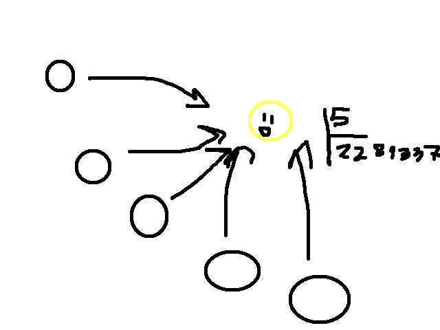
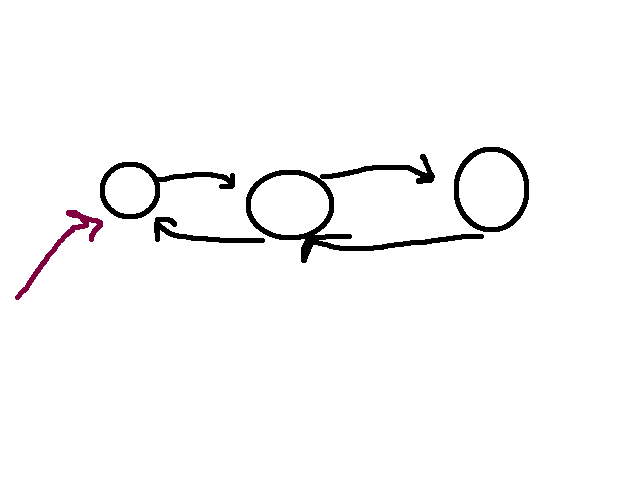
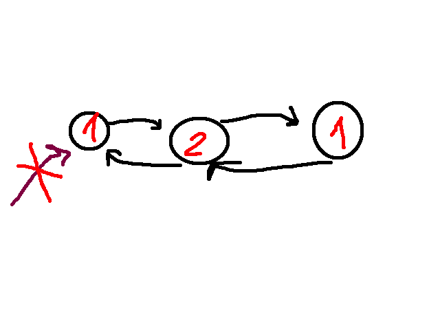
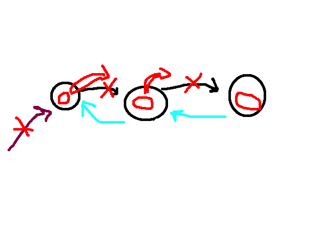
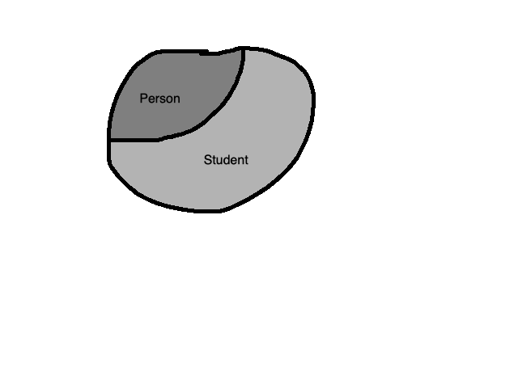

# **Умные указатели**


Мы уже знаем (знаем ведь👀👀👀) как работать с обычными указателями. Также мы знаем, что если мы захотим выделить память, ее надо будет чистить. Чтобы всем этим не заниматься придумали умные указатели, которые (как же это по-человечески) позволяют нам сочно отдыхать на диване и вообще ни о чем не думать.

## **unique_ptr**
```
#include memory

Представляю вашему вниманию самого первого челика, unique_pointer

std::unique_ptr<int> up(new int(123));

По названию можно понять его особенность:

он указывает на кусман памяти, которым одновременно может владеть только один челик.

поинтер отдыхает себе на стеке, строит дом, сажает дерево, но когда приходит злой конец скоупа, стек начинает попаться, чел отлетает, а вместе с ним и очищается память, что он контролит.

очевидно, что копировать его никак нельзя (тупо удален оператор аче нам), потому что представим: есть два таких чела, один умирает, очищается от грехов c++-шных и свою память одновременно, а когда уже второй захочет очиститься, мы словим Undefined Behaviour, так как очищать-то нечего.
```

### *Как работать?*
```cpp

Во-первых, конечно, работает *, по которому можно получить содержимое
Во-вторых, чтобы обратиться к содержимому, нужно взять .get() - эта функция вернет указатель на хранимый элемент, а там уже по старой схеме работаем

Офф-топ его можно мувнуть и свапнуть.

up = std::move(up)
up2 - становится легетимным владельцем памяти, up - остается ни с чем, едет домой (зависит от реализации но обычно nullptr)
```


## **shared_ptr**

а если мы хотим сделать несколько указателей на один кусман памяти?

В дело вступает дружба это магия
```cpp
std::shared_ptr sp(new int(123));
std::shared_ptr sp2;

shared указатели можно уже копировать
sp2 = sp;

второй чел точно также полноправно будет владеть памятью
```


### *как они работают*

есть некоторое общее состояние, которое хранит ссылку на сам объект и количество челов, которые на него указывают.

когда мы удаляем какой-то умный указатель, это общее состояние уменьшает свой счетчик на единичку, а если на него никто уже не смотрит умирает от одиночества (такова жизнь нарциссов:( )

### *Мини-функционал*
```cpp
sp.use_count();
показывает сколько ссылок указывают

только один shared_ptr создается от "внешнего" указателя, все остальные могут получиться только от других shared_ptr (в рамках одного куска памяти конечно)
```


## **weak_ptr**

Немного подумаем какие проблемы есть у shared_ptr.

Представим себе двусвязный список.


у нас каждый челик указывает на следующего и предыдущего, а еще мы отдельно указываем на начало списка, чтобы работать с ним вообще.

Теперь попробуем удалить этот двусзный список, получим:

видно, что нифига у нас не удалится, так как на каждую ноду все еще кто-то указывает. Именно для решения таких проблем и придумали weak_ptr

```cpp
weak_ptr<int> wp2 = sp;
обязательно создается от shared_pointer, он не владеет этой памятью

то есть этот челик не учитывается как указатель в счетчике указателей
```

поэтому сделаем все обратные ссылки weak_ptr и уже все спокойно сократится


```
wp2.lock() возвращает shared_pointer
1) если память освобождена -> nullptr
2) иначе получаем доступ к области памяти, одновременно получая гарантию, что никто эту память не удалит
```

есть также версия для работы с массивом

ДЗ: посмотреть что умеют умные указатели


# **Наследование**

поговорим о наследования классов


Пусть у нас есть два класса
```cpp
class Student {  
public:  
    Student(const std::string &name, int group) : name_(name), group_(group) {}  
  
  
    std::string GetInfo() const {  
        return "name: " + name_ + ", group: " + std::to_string(group_);  
    }  
private:  
    std::string name_;  
    int group_;  
};  
  
class Teacher {  
public:  
    Teacher(const std::string &name, const std::string &course) : name_(name), course_(course) {}  
  
  
    std::string GetInfo() const{  
        return "name: " + name_ + ", course: " + course_;  
    }  
private:  
    std::string name_;  
    std::string course_;  
};
```

теперь мы хотим, к примеру, вывести содержимое студента
```cpp
void Print(const Student& student) {  
    std::cout << student.GetInfo() << std::endl;  
}
```

и нам выведется, фокусов тут нет, но что если мы захотим вывести и учителя?
```cpp 
void Print(const Student& student) {  
    std::cout << student.GetInfo() << std::endl;  
}  
void Print(const Teacher& teacher) {  
    std::cout << teacher.GetInfo() << std::endl;  
}

начинаем играть в "найдите 10 отличий"

функции абсолютно одинаковые, ну и нафиг нам нужно такой копипаст?
```

Здесь важно вспомнить, что учителя тоже люди, поэтому предлагаю создать класс человек
```cpp
class Person {  
public:  
    std::string GetInfo() const {  
        return name_;  
    }  
private:  
    std::string name_;  
};

устроим наследование, для этого после названия класса напишем название предка

class Student : public Person {
	...
}
про private попозже

тоже самое и для teacher
class Teacher : public Person{
	...
}
```

Что мы сделали?

когда класс Student наследуется от Person, он как бы в свое начала вставляет все его методы переменные и прочее. То есть Student это просто продолжение класса Person. 

Самой важной деталью является то, что ссылки и указатели потомков неявно приводятся к ссылкам и указателям предков, поэтому мы можем написать такой код
```cpp

void Print(const Person& person) {
	std::cout << person.GetInfo();
}

int main() {
	Student student = Student("Azik_v_tazik", 2007);
	Print(student);
}

Этот код просто выведет
Azik_v_tazik

и правильно, ведь мы по факту просто запустили GetInfo() от Person, в котором выводится только имя. 

Как-то пока не то, что бы мы хотели, для это в партию вступает virtual
```

```cpp
напишем
class Person {  
public:  
	...
    virtual std::string GetInfo() const {  
        return name_;  
    }  
    ...
};

что делает этот virtual?
```

## **Virtual**

когда в предке мы делаем какую-то функцию virtual, функции в потомках с такой же сигнатурой тоже становятся virtual, что это дает?

с помощью данной приколюхи мы можем вызывать функции как бы из потомков, но по факту из себя же. Посмотрим на код
```cpp

class Person {  
	...
    virtual std::string GetInfo() const {  
        return name_;  
    } 
    ...
};  
  
class Student : public Person {  
	...
    std::string GetInfo() const {  
        return "name: " + name_ + ", group: " + std::to_string(group_);  
    }  
	...
};

  
void Print(const Person &person) {  
    std::cout << person.GetInfo();  
}  
  
int main() {  
    Student student = Student("Ivan", 123);  
    Print(student);  
}

что тут выведется? Именно, что GetInfo() от Student

то есть у нас был какой-то студент, затем он стал личностью, но функция у нас запустилась от студента???

Именно для этого и нужен virtual
```

```cpp
Как это реализуется?
У каждого объекта, у которого есть хотя бы одна виртуальная функция, есть такая штука как __vfptr - указатель на его таблицу виртуальных функций.

Таблица виртуальных функций это грубо говоря такой map<name_, goto> то есть по имени функции можно найти функцию, которую надо запускать.

Когда мы неявно преобразуем student к person, наш __vfptr остается, соотвественно у нас остается таблица виртуальных функций от класса Student, а не Person.

А в этой таблице как раз и лежит функция Student::GetInfo(), а не Person::GetInfo()

Если бы изначально передавали Person, то конечно же и таблица была бы соотвествующая.
```

Чем плохи virtual вызовы?
1) сам поиск в таблице и прочее не очень то и быстрый
2) такие функции нельзя заинлайнить (inline Foo), то есть сэкономить на создании локальных переменных и прочем, и заинлайнить мы не можем, потому что на этапе компиляции не можем знать тип объекта

```cpp
Таблица запускается для ссылок и указателей

void Print(Student student) {
	return Student.GetInfo();
}
в этом случае он просто возьмет метод в своем классе, без каких-либо поисков
```

Стоит повторить, что virtual обычно подразумевает переписку функций внутри потомков, если функция не переписана, то будет запускаться от предковской.
```
Для того, чтобы не забыть переписать функцию с той же сигнатурой используется override 

void Foo() override {}

оно говорит компилятору, что где-то в предках должна быть функция, которую мы хотим переписать, так что если такой нет ты пожалуйся

```


### **вызов методов предка внутри класса**
```cpp
олды тут?

наша функция внутри Student была такой
std::string GetInfo() const override{  
    return "name: " + name_ + ", group: " + std::to_string(group_);  
}
но так как имя уже есть и в Person было бы неплохо вызывать его
std::string GetInfo() const override{  
    return GetInfo() + ", group: " + std::to_string(group_);  
}
да, это рекурсия. Менеджер виртуальных таблиц найдет опять таки Student::GetInfo() потому что в виртуальной таблице именно он и лежит
чтобы вызывать предковый, нужно написать
std::string GetInfo() const override{  
    return Person::GetInfo() + ", group: " + std::to_string(group_);  
}
```


## **деструктор**
```cpp
ну сначала конструктор

тут все просто сначала от предка потом к потомку, потому что мы в конструкторе потомка вызываем конструктор предка.

А вот с деструктор не все так тривиально. Вообще деструктор нужно делать virtual
Person person* = new Student("Ivan", 2010);
delete person

то произойдет Undefined Behaviour

так как деструктор не виртуальный, то он позовется именно от Person, получается что деструктор от Student не позовется

понятно, что это приведет к плохим последствиям, так что всегда пишем

virtual ~Person {
	
}
```


# **Абстрактный класс**

Если хотя бы один метод класса является чистым виртуальным, то класс называется абстрактным
```cpp
Чистый виртуальный метод выглядит так
virtual void foo() = 0; 
то есть просто абстрактный метод не имеющий определения.

мы не можем создать объект абстрактного класса (логично ведь часть функций не определена)

методы абстрактного класса нужны только для того, чтобы их наследовали и переписывали
```

ну к примеру такой класс
```cpp

class Printable{
	public:
	virtual void Print() const {}
}

virtual void Print() const = 0; // чисто виртуальный метод

эта штука говорит, что в наследниках обязательно должен быть метод принт, который мы как раз и перепишем

void Print(const Printable& printable) {
	printable.Print();
}

Print(student);
```

> класс в котором все методы виртуальными называется интерфейс


Чисто офф-топ не вызывайте виртуальные штуки из конструкторов и деструкторов, так как такая функция к моменты вызова могла еще не появиться или уже удалиться